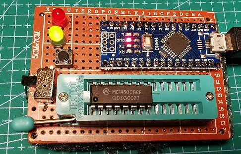

I had to whip up this tester for MC14500 ICUs after finding that some chips I was shipped were faulty (fake?!).

The Arduino drives directly the pins of the MC14500 and tests every instruction, validating the pin statuses
against expected values.

There's an ageing mode in which the tests keep running, at few seconds interval. If a fault is found the 
testing stops and the red LED lights up. This allows to catch also intermittent faults.

Serial output is showing the tests being run and eventual failures.

